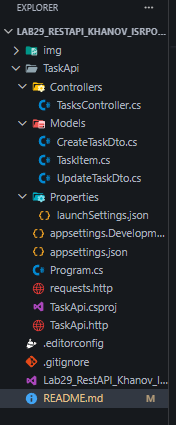

# Лабораторная работа №29: REST API на ASP.NET Core

## Основная информация

**ФИО:** Ханов Владислав Вячеславович  
**Группа:** ИСП-231  
**Дата:** 22.04.2026  

## Краткое описание работы

В ходе лабораторной работы изучены принципы построения REST API на платформе ASP.NET Core с использованием **Controller-based API**.  
Реализован полноценный CRUD-контроллер для управления задачами (`TaskItem`), освоены:

- Маршрутизация с помощью атрибутов (`[HttpGet]`, `[HttpPost]` и др.)
- Использование DTO для защиты от некорректных данных
- Возврат правильных HTTP-статусов (`200 OK`, `201 Created`, `404 NotFound` и т.д.)
- Автоматическая документация через **Swagger UI**
- Тестирование API через **REST Client** (файлы `.http`)
- Настройка **CORS** для взаимодействия с фронтендом
- Дополнительные возможности: поиск, фильтрация, сортировка, статистика

## Структура проекта

## Список реализованных маршрутов

| HTTP метод | Маршрут                          | Описание                              |
|------------|----------------------------------|---------------------------------------|
| GET        | `/api/tasks`                     | Получить все задачи                   |
| GET        | `/api/tasks?completed=true/false`| Фильтрация по статусу                 |
| GET        | `/api/tasks/{id}`                | Получить задачу по id                 |
| GET        | `/api/tasks/search?query=...`    | Поиск по заголовку/описанию           |
| GET        | `/api/tasks/priority/{level}`    | Фильтрация по приоритету              |
| GET        | `/api/tasks/stats`               | Статистика (всего/выполнено/осталось) |
| GET        | `/api/tasks/sorted?by=...&desc=...`| Сортировка по приоритету или дате   |
| POST       | `/api/tasks`                     | Создать новую задачу                  |
| PUT        | `/api/tasks/{id}`                | Полностью обновить задачу             |
| PATCH      | `/api/tasks/{id}/complete`       | Переключить статус выполнения         |
| DELETE     | `/api/tasks/{id}`                | Удалить задачу                        |

## Итоговая таблица: ASP.NET Core Controller-based API

| Аспект                | ASP.NET Core Controllers                          |
|-----------------------|---------------------------------------------------|
| Маршруты              | `[HttpGet]` атрибут над методом                  |
| Группировка маршрутов | Класс-контроллер                                 |
| Базовый URL           | `[Route("api/[controller]")]`                    |
| Параметр пути         | `(int id)` — параметр метода                     |
| Параметр запроса      | `[FromQuery] bool? completed`                    |
| Тело запроса          | `[FromBody] CreateTaskDto dto`                   |
| Ответ 200             | `return Ok(data);`                               |
| Ответ 201             | `return CreatedAtAction(...);`                   |
| Ответ 404             | `return NotFound(...);`                          |
| Ответ 204             | `return NoContent();`                            |
| Типизация данных      | Строгая (C#)                                     |
| Документация          | Swagger — устанавливается отдельно               |

## Главные выводы

1. **REST — не протокол, а архитектурный стиль.** Те же принципы работают с любым языком и фреймворком.

2. **Контроллер в ASP.NET Core = Router в Express**, только с автоматической документацией и строгой типизацией.

3. **DTO защищает API от некорректных данных:** клиент передаёт только то, что сервер разрешает принять.

4. **Swagger UI позволяет тестировать API без Postman** и без написания тестового JavaScript-кода.

5. **Правильные HTTP-статусы — часть «контракта» API.** Клиент должен понимать, что произошло, по коду ответа.